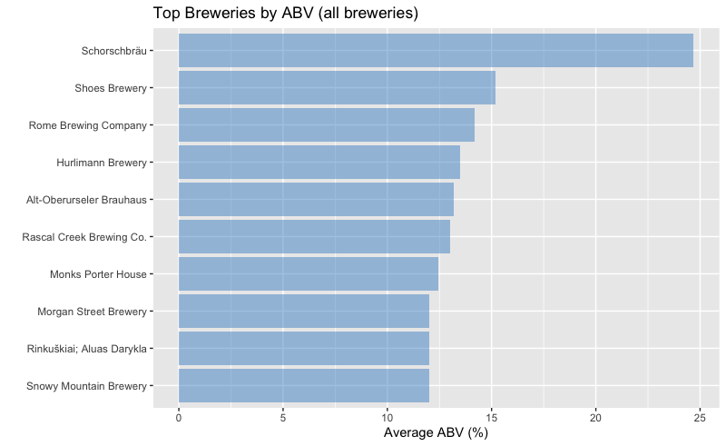
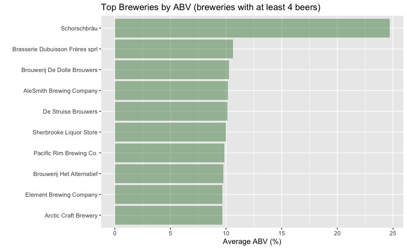
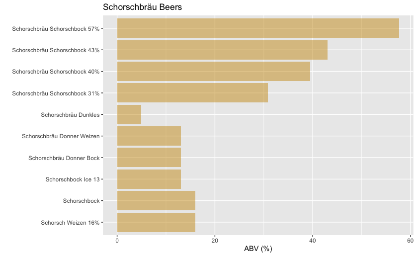
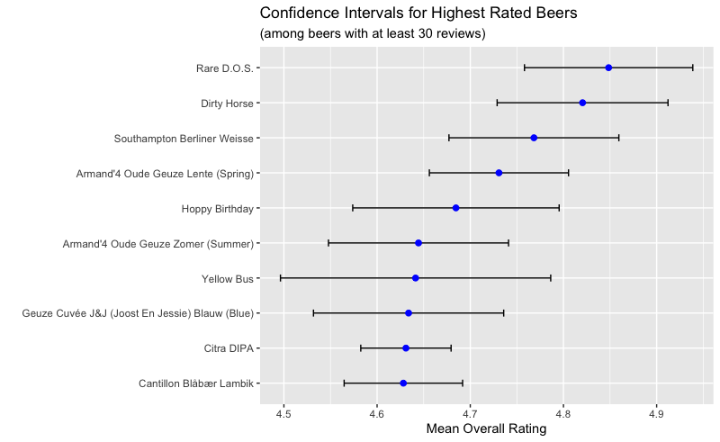
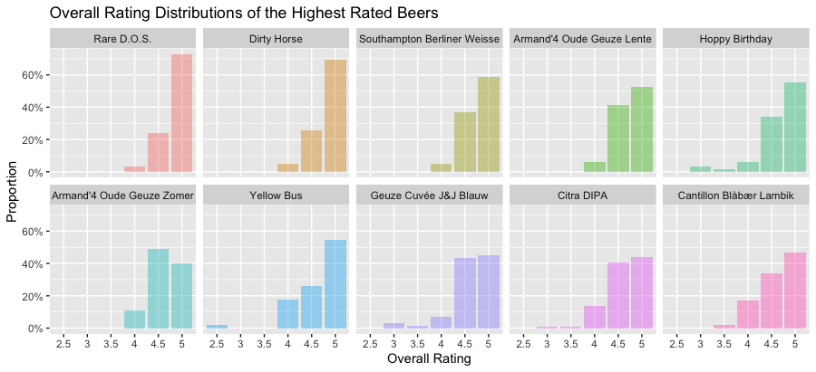
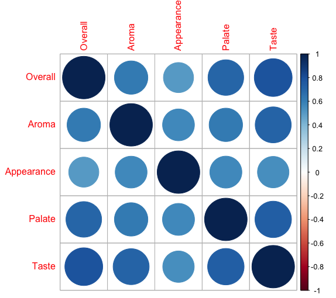

# BeerAdvocate Dataset Analysis

*by Alex Neal ([alexneal.net](https://www.alexneal.net)) on November 9, 2020*

This analysis aims to answer a set of four questions related to the [BeerAdvocate dataset](https://data.world/socialmediadata/beeradvocate). For each question, I briefly describe my methodology and then present results and visualizations. The R/Tidyverse code is included at the end of this report, and is also available [here](https://github.com/alex-neal/beer/blob/master/beer.R).

## Which brewery produces the strongest beers by ABV?

We want to calculate the average ABV of each brewery's set of beers, and then find the brewery whose average is the highest. This can be achieved in 4 steps: 

1. Remove all rows where the ABV value is missing.
2. Calculate the mean ABV of every *beer* in the dataset. (This is simply a policy to handle any discrepencies in ABV among the reviews for a particular beer) 
3. Calculate the average ABV of each brewery's beers by grouping the results of step 2 by brewery and taking the mean.
4. Sort the breweries in order of decreasing average ABV. 

The following bar plot shows the average ABV for the top 10 breweries in the ranking. 

<p align="center">
  
</p>

Some of these breweries (e.g. Shoes, Alt-Oberurseler, and Rascal Creek) only have a single beer in the dataset. One beer isn't enough information to indicate that a brewery *consistently* creates high-ABV beers. Let's make another plot that only considers breweries with at least 4 different beers.

<p align="center">
  
</p>

In any case, the German brewery **Schorschbräu is the clear winner**. *Prost!* Let's have a look at the potent beers they have on tap:

<p align="center">
  
</p>

<br>

## If you had to pick 3 beers to recommend using only this data, which would you pick?


We begin by asking: *How many reviews does a beer need in order for its average review score to be considered reliable?* As a partially arbitrary choice, we will choose to recommend only beers that have been reviewed 30 or more times.

For the purposes of this analysis, we assume that bias in the dataset is negligible. Let's apply some statistics to make things a little more interesting. Imagine that every beer in the dataset was tasted and rated by all of the world's beer lovers. If that were the case, we could calculate an "objectively true" rating for each beer. Since our "sample" of reviews for each beer is at least 30 reviews, we can apply the *central limit theorem* to construct a 95% confidence interval for the "true" mean rating of each beer. Visualizing the confidence intervals can provide some extra insight when comparing the average ratings of different beers. 

We perform the following steps on the dataset:

1. Filter out all beers with less than 30 reviews.
2. For every beer, calculate the total number of reviews, the mean overall rating, and the standard deviation of the overall rating.
3. Use the results of step 2 to calculate the 95% confidence interval for the "true" mean rating of each beer. 
4. Arrange the beers in order of decreasing mean overall rating.

The next visualization shows average overall ratings of the top 10 beers, along with the corresponding confidence intervals. 

<p align="center">
  
</p>

It is reasonable to say that for most of the beers shown, the calculated average rating is roughly within a margin of 0.1 from the rating that the beer truly deserves. The Yellow Bus margin is a bit larger, while the Citra DIPA margin is smaller. 

We might also like to know how these 10 beers compare in terms of the distribution of overall ratings received (The ratings themselves are discrete-valued in the range [0,5] with increments of 0.5). 

<p align="center">
  
</p>

Here we can observe that the top three beers in the ranking didn't receive any reviews below 4 stars, and they hardly received any reviews below 4.5 stars. Rare D.O.S., the number one beer, received a 5 star review over 70% of the time. 

**The above visualizations do not provide any evidence against recommending the top three beers in the ranking, so those are the ones that I have chosen.** Here they are along with their average ratings:

| Brewery                                 | Beer            | Aroma | Taste | Appearance | Palate | Overall |
|-----------------------------------------|-----------------|-------|-------|------------|--------|---------|
| Peg's Cantina & Brewpub / Cycle Brewing | Rare D.O.S.     | 4.76  | 4.85  | 4.47       | 4.80   | 4.85    |
| De Struise Brouwers                     | Dirty Horse     | 4.62  | 4.74  | 4.42       | 4.58   | 4.82    |
| Southampton Publick House               | Berliner Weisse | 4.35  | 4.56  | 4.18       | 4.39   | 4.77    |

<br>


## Which of the factors (aroma, taste, appearance, palate) are most important in determining the overall quality of a beer?

To answer this question, we need to calculate the correlation between the four factors and the overall rating. A quick way to do that is to create and visualize a correlation matrix.

<p align="center">
  
</p>

The visualization shows that taste has a stronger positive correlation with overall score than any of the other three factors. **Taste is therefore the most important factor in determining the overall quality of a beer, according to the data.** 


<br>

## If I typically enjoy a beer due to its aroma and appearance, which beer style should I try?

This question requires a strategy for combining each beer style's average aroma and appearance rankings into a single composite score. A simple, effective option is to use the average (or equally, the midpoint) of the two metrics. This suggests the following process:

1. Calculate the mean aroma and mean appearance score for every *style* of beer. 
2. Generate the composite score for each style by averaging the aroma and appearance means. 
3. Rank the beer styles in order of decreasing composite score.

The analysis suggests that you should try an **American Double / Imperial Stout**, which has a composite score of 4.16. It is shown along with the other top two contenders in the following table.


| Style                            | Avg. Aroma | Avg. Appearance | Composite |
|----------------------------------|------------|-----------------|-----------|
| American Double / Imperial Stout | 4.16       | 4.16            | 4.16      |
| Russian Imperial Stout           | 4.08       | 4.21            | 4.14      |
| Quadrupel (Quad)                 | 4.13       | 4.12            | 4.13      |

<br>

## R Code

### Import Libraries

```R
require(tidyverse)
require(corrplot)
```

### Import Data

```R
df = read_csv('beer_reviews.csv')
```

### Which brewery produces the strongest beers by ABV?

```R
# Rank breweries by average beer ABV
strongest = df %>% 
  drop_na(beer_abv) %>%
  group_by(brewery_name, beer_name) %>% 
  summarize(abv=mean(beer_abv)) %>% 
  group_by(brewery_name) %>% 
  summarize(mean_abv=mean(abv), beer_count=n()) %>% 
  arrange(desc(mean_abv))

# Fix character issue in 9th brewery name
strongest$brewery_name[9] = "Rinkuškiai; Aluas Darykla"

# Make brewery name an ordered factor so ggplot will display bars in rank order
strongest$brewery_name = factor(strongest$brewery_name, levels=rev(strongest$brewery_name))

# Vizualize top 10 for all breweries
strongest %>% head(10) %>%
  ggplot() + geom_col(aes(x=brewery_name, y=mean_abv), fill='steelblue3', alpha=0.5) + coord_flip() +
  ggtitle('Top Breweries by ABV (all breweries)') + ylab('Average ABV (%)') + xlab('') 

# Vizualize top 10 for breweries with at least 4 beers
strongest %>% filter(beer_count > 3) %>% head(10) %>%
  ggplot() + geom_col(aes(x=brewery_name, y=mean_abv), fill='palegreen4', alpha=0.5) + coord_flip() +
  ggtitle('Top Breweries by ABV (breweries with at least 4 beers)') + 
  ylab('Average ABV (%)') + xlab('') 

# Take a look at Schorschbräu's beers
schorschbrau = df %>%
  filter(brewery_name=='Schorschbräu') %>% 
  distinct(beer_name, beer_abv)

# Vizualize Schorschbräu beers
ggplot(schorschbrau) + geom_col(aes(x=beer_name, y=beer_abv), fill='goldenrod3', alpha=0.5) +
  coord_flip() + ggtitle('Schorschbräu Beers') + ylab('ABV (%)') + xlab('')
```


### If you had to pick 3 beers to recommend using only this data, which would you pick?

```R
# Collect top 10 beers with at least 30 reviews and calculate CI for each mean rating
beers = df %>% group_by(brewery_name, beer_name) %>%
  summarize(mean_aroma=mean(review_aroma), mean_taste=mean(review_taste), 
            mean_appearance=mean(review_appearance), mean_palate=mean(review_palate),
            mean_overall=mean(review_overall), sd_overall=sd(review_overall), 
            review_count=n()) %>%
  filter(review_count > 30) %>%
  mutate(ci=qnorm(0.975)*sd_overall/sqrt(review_count)) %>%  # Add a 95% CI
  arrange(desc(mean_overall)) %>% 
  head(10)

# Make beer name an ordered factor so ggplot will display bars in rank order
beers$beer_name = factor(beers$beer_name, levels=rev(beers$beer_name))

# Vizualize mean ratings and confidence intervals
ggplot(beers, aes(x=beer_name, y=mean_overall)) +
  geom_errorbar(aes(ymin=mean_overall-ci, ymax=mean_overall+ci),
                width=.2, position=position_dodge(.9)) + 
  geom_point(size=2, col='blue') +
  coord_flip() + xlab('') + ylab('Mean Overall Rating') +
  ggtitle('Confidence Intervals for Highest Rated Beers', 
          subtitle="(among beers with at least 30 reviews)")


# Collect all the data for these 10 beers
beers2 = df %>% filter(beer_name %in% beers$beer_name)
beers2$beer_name = factor(beers2$beer_name, levels=beers$beer_name)

# Shorten beer names that are too long for the plot
levels(beers2$beer_name)[levels(beers2$beer_name)=="Geuze Cuvée J&J (Joost En Jessie) Blauw (Blue)"] = 
  "Geuze Cuvée J&J Blauw"
levels(beers2$beer_name)[levels(beers2$beer_name)=="Armand'4 Oude Geuze Lente (Spring)"] = 
  "Armand'4 Oude Geuze Lente"
levels(beers2$beer_name)[levels(beers2$beer_name)=="Armand'4 Oude Geuze Zomer (Summer)"] = 
  "Armand'4 Oude Geuze Zomer"

# Visualize Distributions
ggplot(beers2, aes(x=factor(review_overall), group=beer_name)) + 
  geom_bar(aes(y=..prop.., fill=beer_name), alpha=.4, stat="count") + 
  scale_y_continuous(labels=scales::percent) +
  facet_wrap(vars(beer_name), ncol=5) +
  theme(legend.position="none") +
  ylab('Proportion') + xlab('Overall Rating') +
  ggtitle("Overall Rating Distributions of the Highest Rated Beers")
```

### Which of the factors (aroma, taste, appearance, palate) are most important in determining the overall quality of a beer?

```R
# Collect rating columns
reviews = select(df, c('review_overall', 'review_aroma', 'review_appearance', 
                       'review_palate', 'review_taste'))

# Rename Columns
names(reviews) = c('Overall', 'Aroma', 'Appearance', 'Palate', 'Taste')

# Calculate correlation matrix
M = cor(reviews)

# Visualize correlation matrix
corrplot(M)
```

### If I typically enjoy a beer due to its aroma and appearance, which beer style should I try?

```R
# Calculate composite score for each style and rank
df %>% group_by(beer_style) %>%
  summarize(count=n(), mean_aroma=mean(review_aroma), mean_appearance=mean(review_appearance)) %>%
  mutate(composite_score=(mean_aroma+mean_appearance)/2) %>%
  arrange(desc(composite_score))
```