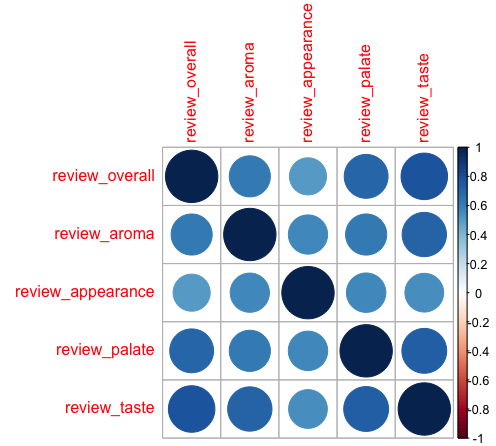

# BeerAdvocate Dataset Analysis

## 1. Which brewery produces the strongest beers by ABV?

Methodology:
1. Remove all rows where the ABV value is missing.
2. Calculate the mean ABV of every *beer* in the dataset. This is the policy to handle any discrepency in ABV among different reviews for a particular beer. 
3. Calculate the average ABV for each brewery by grouping the results of step 2 by brewery and taking the mean again.
4. Rank the breweries in order of decreasing average ABV. 

## 2. If you had to pick 3 beers to recommend using only this data, which would you pick?

First, it is necessary to answer this question: How many reviews does a beer need in order for its average review score to be considered reliable? 

Somewhat arbitrarily, I chose 30. This leads to the following methodology:
1. Calculate the total number of reviews and mean overall score for every beer.
2. Filter out all beers with less than 30 reviews.
3. Arrange the beers in order of decreasing mean score.

## 3. Which of the factors (aroma, taste, appearance, palette) are most important in determining the overall quality of a beer?

To answer this question, we can simply visualize a correlation matrix of the four factors along with the overall score.

We see that taste has a stronger positive correlation with overall score than any of the other three factors. **Taste is therefore the most important factor in determining the overall quality of a beer, according to the data.** 

## 4. If I typically enjoy a beer due to its aroma and appearance, which beer style should I try?

Methodology: 
1. Calculate the mean aroma and mean appearance scores for every *style* of beer. 
2. Generate a composite score by averaging the aroma and appearance means. 
3. Rank the beer styles in order of decreasing composite score.

Result:

## Code

### Which brewery produces the strongest beers by ABV?

### If you had to pick 3 beers to recommend using only this data, which would you pick?

### Which of the factors (aroma, taste, appearance, palette) are most important in determining the overall quality of a beer?

### If I typically enjoy a beer due to its aroma and appearance, which beer style should I try?