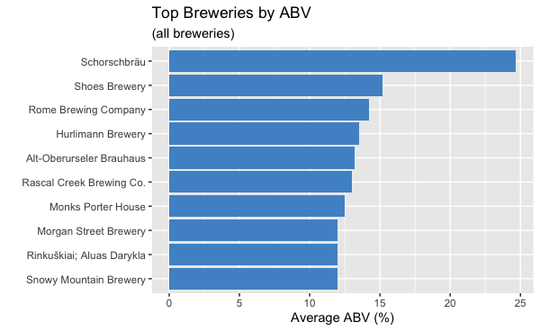
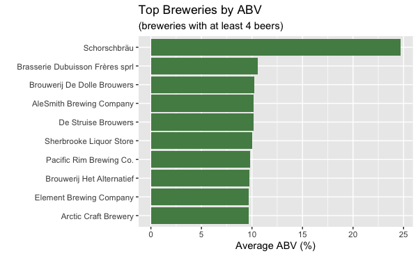
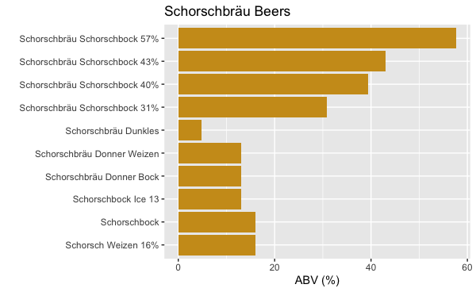
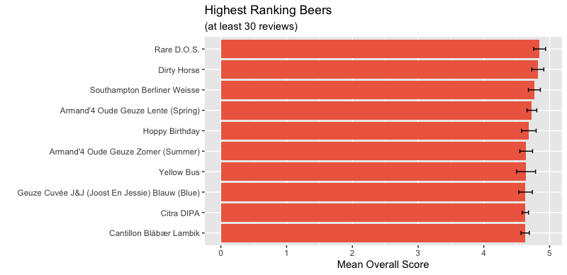

# BeerAdvocate Dataset Analysis

## Which brewery produces the strongest beers by ABV?

#### Methodology:
1. Remove all rows where the ABV value is missing.
2. Calculate the mean ABV of every *beer* in the dataset. This is the policy to handle any discrepencies in ABV among the reviews for a particular beer. 
3. Calculate the average ABV for each brewery by grouping the results of step 2 by brewery and taking the mean again.
4. Rank the breweries in order of decreasing average ABV. 

#### Results:
The following plot shows the average ABV of the top 10 breweries in the ranking. 



Some of these breweries (e.g. Shoes, Alt-Oberurseler, and Rascal Creek) only have a single beer in the dataset. One beer isn't enough information to indicate if a brewery *consistently* creates high-ABV beers. Lets make another plot which only considers breweries with at least 4 different beers in the dataset.



In any case, the German brewery **Schorschbräu is the clear winner**. *Prost!* Let's have a look at what they have on tap:




<br>

## If you had to pick 3 beers to recommend using only this data, which would you pick?

#### Methodology:
First, I had to answer this question: How many reviews does a beer need in order for its average review score to be considered reliable? 

I chose 30.  This leads to the following methodology:
1. Calculate the total number of reviews and mean overall score for every beer.
2. Filter out all beers with less than 30 reviews.
3. Arrange the beers in order of decreasing mean score.

#### Results:




The confidence intervals of the top three beers are sufficiently tight, so I will choose to recommend each of them. Here they are along with their average ratings:

| Brewery                                 | Beer            | Aroma | Taste | Appearance | Palate | Overall |
|-----------------------------------------|-----------------|-------|-------|------------|--------|---------|
| Peg's Cantina & Brewpub / Cycle Brewing | Rare D.O.S.     | 4.76  | 4.85  | 4.47       | 4.80   | 4.85    |
| De Struise Brouwers                     | Dirty Horse     | 4.62  | 4.74  | 4.42       | 4.58   | 4.82    |
| Southampton Publick House               | Berliner Weisse | 4.35  | 4.56  | 4.18       | 4.39   | 4.77    |

<br>

## Which of the factors (aroma, taste, appearance, palette) are most important in determining the overall quality of a beer?

#### Methodology:
To answer this question, we can simply calculate a correlation matrix of the four factors along with the overall score.

#### Results:


We see that taste has a stronger positive correlation with overall score than any of the other three factors. **Taste is therefore the most important factor in determining the overall quality of a beer, according to the data.** 


<br>

## If I typically enjoy a beer due to its aroma and appearance, which beer style should I try?

#### Methodology: 
1. Calculate the mean aroma and mean appearance score for every *style* of beer. 
2. Generate a composite score for each style by averaging the aroma and appearance mean. 
3. Rank the beer styles in order of decreasing composite score.

#### Results:
You should try an **American Double / Imperial Stout**, which has a composite score of 4.16. It is shown along with the other top two contenders in the following table.


| Style                            | Avg. Aroma | Avg. Appearance | Composite |
|----------------------------------|------------|-----------------|-----------|
| American Double / Imperial Stout | 4.16       | 4.16            | 4.16      |
| Russian Imperial Stout           | 4.08       | 4.21            | 4.14      |
| Quadrupel (Quad)                 | 4.13       | 4.12            | 4.13      |

<br>

## R Code

### Import Libraries

```R
require(tidyverse)
require(corrplot)
```

### Import Data

```R
df = read_csv('beer_reviews.csv')
```

### Which brewery produces the strongest beers by ABV?

```R
# Rank breweries by average beer ABV
strongest = df %>% 
  drop_na(beer_abv) %>%
  group_by(brewery_name, beer_name) %>% 
  summarize(abv=mean(beer_abv)) %>% 
  group_by(brewery_name) %>% 
  summarize(mean_abv=mean(abv), beer_count=n()) %>% 
  arrange(desc(mean_abv))

# Fix character issue in 9th brewery name
strongest$brewery_name[9] = "Rinkuškiai; Aluas Darykla"

# Make brewery name an ordered factor so ggplot will display bars in rank order
strongest$brewery_name = factor(strongest$brewery_name, levels=rev(strongest$brewery_name))

# Vizualize top 10 for all breweries
strongest %>% head(10) %>%
  ggplot() + geom_col(aes(x=brewery_name, y=mean_abv), fill='steelblue3') + coord_flip() +
  ggtitle('Top Breweries by ABV', subtitle='(all breweries)') + ylab('Average ABV (%)') + xlab('') 

# Vizualize top 10 for breweries with at least 4 beers
strongest %>% filter(beer_count > 3) %>% head(10) %>%
  ggplot() + geom_col(aes(x=brewery_name, y=mean_abv), fill='palegreen4') + coord_flip() +
  ggtitle('Top Breweries by ABV', subtitle='(breweries with at least 4 beers)') + 
  ylab('Average ABV (%)') + xlab('') 

# Take a look at Schorschbräu's beers
schorschbrau = df %>%
  filter(brewery_name=='Schorschbräu') %>% 
  distinct(beer_name, beer_abv)

# Vizualize Schorschbräu beers
ggplot(schorschbrau) + geom_col(aes(x=beer_name, y=beer_abv), fill='goldenrod3') +
  coord_flip() + ggtitle('Schorschbräu Beers') + ylab('ABV (%)') + xlab('')
```


### If you had to pick 3 beers to recommend using only this data, which would you pick?

```R
# Get top 10 beers by overall score
beers = df %>% group_by(brewery_name, beer_name) %>%
  summarize(mean_aroma=mean(review_aroma), mean_taste=mean(review_taste), 
            mean_appearance=mean(review_appearance), mean_palate=mean(review_palate),
            mean_overall=mean(review_overall), sd_overall=sd(review_overall), 
            review_count=n()) %>%
  filter(review_count > 30) %>%
  mutate(ci=qnorm(0.975)*sd_overall/sqrt(review_count)) %>%  # Add a 95% CI
  arrange(desc(mean_overall)) %>% 
  head(10)

# Make beer name an ordered factor so ggplot will display bars in rank order
beers$beer_name = factor(beers$beer_name, levels=rev(beers$beer_name))
ggplot(beers, aes(x=beer_name, y=mean_overall)) +
  geom_col(fill='coral2') +
  geom_errorbar(aes(ymin=mean_overall-ci, ymax=mean_overall+ci),
                width=.2, position=position_dodge(.9)) + 
  coord_flip() + xlab('') + ylab('Mean Overall Score') +
  ggtitle('Highest Ranking Beers', subtitle="(at least 30 reviews)")
```

### Which of the factors (aroma, taste, appearance, palette) are most important in determining the overall quality of a beer?

```R
# Calculate correlation matrix
reviews = select(df, c('review_overall', 'review_aroma', 'review_appearance', 
                       'review_palate', 'review_taste'))
M = cor(reviews)

# Visualize correlation matrix
corrplot(M)
```

### If I typically enjoy a beer due to its aroma and appearance, which beer style should I try?

```R
# Calculate composite score for each style and rank
df %>% group_by(beer_style) %>%
  summarize(count=n(), mean_aroma=mean(review_aroma), mean_appearance=mean(review_appearance)) %>%
  mutate(composite_score=(mean_aroma+mean_appearance)/2) %>%
  arrange(desc(composite_score))
```